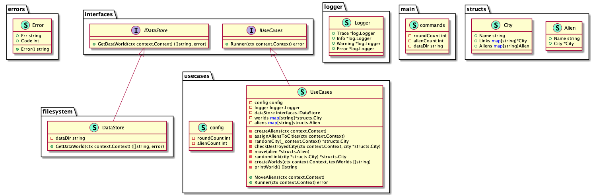

Alien invasion
==============
Mad aliens are about to invade the earth and you are tasked with simulating the
invasion.
You are given a map containing the names of cities in the non-existent world of
X. The map is in a file, with one city per line. The city name is first,
followed by 1-4 directions (north, south, east, or west). Each one represents a
road to another city that lies in that direction.
For example:

`
Foo north=Bar west=Baz south=Qu-ux
Bar south=Foo west=Bee
`

The city and each of the pairs are separated by a single space, and the
directions are separated from their respective cities with an equals (=) sign.
You should create N aliens, where N is specified as a command-line argument.
These aliens start out at random places on the map, and wander around randomly,
following links. Each iteration, the aliens can travel in any of the directions
leading out of a city. In our example above, an alien that starts at Foo can go
north to Bar, west to Baz, or south to Qu-ux.
When two aliens end up in the same place, they fight, and in the process kill
each other and destroy the city. When a city is destroyed, it is removed from
the map, and so are any roads that lead into or out of it.
In our example above, if Bar were destroyed the map would now be something
like:

`
Foo west=Baz south=Qu-ux
`

Once a city is destroyed, aliens can no longer travel to or through it. This
may lead to aliens getting "trapped".
You should create a program that reads in the world map, creates N aliens, and
unleashes them. The program should run until all the aliens have been
destroyed, or each alien has moved at least 10,000 times. When two aliens
fight, print out a message like:

`
Bar has been destroyed by alien 10 and alien 34!
`

(If you want to give them names, you may, but it is not required.) Once the
program has finished, it should print out whatever is left of the world in the
same format as the input file.
Feel free to make assumptions (for example, that the city names will never
contain numeric characters), but please add comments or assertions describing
the assumptions you are making.

### Run project
`
go run ./cmd/... -rounds=10000 -aliens=3 -data-dir=testdata/world.txt
`

### General Overview

uml created with [goplantuml](github.com/jfeliu007/goplantuml/cmd/goplantuml) and command exist in MakeFile

###Internal Folder
Private application and library code. This is the code you don't want others importing in their applications or libraries. Note that this layout pattern is enforced by the Go compiler itself. See the [Go 1.4](https://golang.org/doc/go1.4#internalpackages) for more details. Note that you are not limited to the top level internal directory. You can have more than one internal directory at any level of your project tree.

### Structure Project
try to use best structure project. because I have experience work with [clean architecture](https://blog.cleancoder.com/uncle-bob/2012/08/13/the-clean-architecture.html
) choose for this project. clean architecture has five major principles I follow in this project.

1.  Independent of Frameworks. The architecture does not depend on the existence of some library of feature laden software. This allows you to use such frameworks as tools, rather than having to cram your system into their limited constraints.
2.  Testable. The business rules can be tested without the UI, Database, Web Server, or any other external element.
3.  Independent of UI. The UI can change easily, without changing the rest of the system. A Web UI could be replaced with a console UI, for example, without changing the business rules.
4.  Independent of Database. You can swap out Oracle or SQL Server, for Mongo, BigTable, CouchDB, or something else. Your business rules are not bound to the database.
5.  Independent of any external agency. In fact your business rules simply don’t know anything at all about the outside world.

### Todo
- [X] read file (line by line)

- [X] create world (each city and directions)
  
- [X] get count aliens of cli

- [X] picking random aliens in the world

- [X] moving alien randomly

- [X] condition same place for two aliens and destroy city

- [X] remove destroyed city

- [X] destroyed city become trapped

- [X] continue to destroy all aliens or each aliens received to 10,000 moved

- [X] log print destroy city is `Bar has been destroyed by alien 10 and alien 34!`

- [X] after finished print city name city same the read start file
